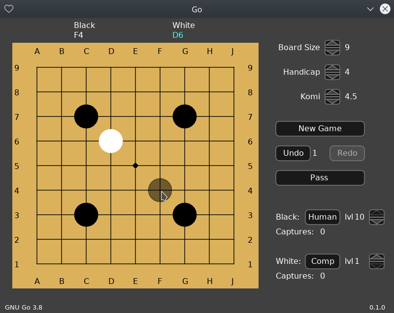

# love-go
Go board game for Love2D

The dragger gui object  works by clicking and dragging up and down to change its associated value.

## Getting GNU Go

The game requires GNU Go so that it can be used as an "Oracle" to generate board positions.

Getting GNU Go for Linux and Mac users is a fairly straight-forward process.

For Debian/Ubuntu users:

    apt install gnugo

For Mac users:

    brew install gnu-go

For Windows users, binaries can be downloaded at http://gnugo.baduk.org/. It doesn't come with an installer, so the binaries need to be manually extracted to the folder `C:\Program Files\gnugo\`.
